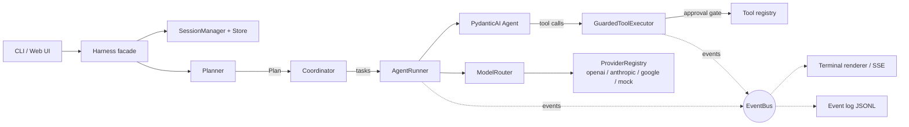

# om-harness

A context-efficient AI coding-agent harness for real git repositories.

om-harness runs AI coding agents inside your project: it inspects the repo,
plans the work, edits files, runs tests, and reports what it did — while
keeping a tight lid on context usage, latency, and cost.

```console
$ cd your-project
$ om-harness init
$ om-harness run "fix the failing test in test_worker.py"
```

---

## Why om-harness exists

Most coding-agent demos are a thin loop around a chat model: they resend the
whole conversation, the entire system prompt, and every file the agent ever
saw — on every single turn. That wastes tokens, adds latency, and makes
multi-step and multi-agent work needlessly expensive and unpredictable.

om-harness is built around three ideas that address this directly:

1. **Context is a budget, not a dump.** Repository context comes from a
   cached, bounded file index (paths + sizes, not contents). System prompts
   are small and role-scoped. Agents exchange compact structured
   `TaskResult`s, never conversation transcripts. Old history is summarized,
   not resent. Everything sent to the model is itemized in a token report.
2. **Orchestration is a plan, not vibes.** A planner picks the simplest
   strategy that can complete the goal — usually a single agent. When it
   doesn't, work is expressed as an inspectable task graph (sequential
   pipeline, parallel fan-out/fan-in, or implement→review) executed by a
   coordinator with bounded concurrency, timeouts, retries, and cancellation.
3. **Reliability and safety are structural.** Every meaningful operation is
   a typed event on one bus (UIs, logs, and persistence all subscribe to the
   same stream). State is durable and resumable. Tools carry permission
   levels (read-only / mutating / destructive) gated by a configurable
   approval policy that fails safe in non-interactive contexts.

It is **not** an agent framework you build products on top of — it is a
working coding assistant, plus a small, readable codebase where every design
decision is visible.

## Feature highlights

- **CLI-first**: `init`, `run`, `chat`, `agent`, `providers`, `doctor`,
  `status`, `resume`, `config` — each with `--json` output for automation.
- **Multi-provider** via [PydanticAI](https://ai.pydantic.dev): OpenAI,
  Anthropic, Google/Gemini plus any OpenAI-compatible endpoint through one
  interface; your selected model always wins, with per-task routing and
  clear errors when a provider is unavailable. An offline echo model exists
  only for explicit `mock:` configuration in demos and tests — it is never
  auto-selected.
- **Async orchestration**: parallel fan-out/fan-in with deterministic
  aggregation, per-task timeouts, retries with backoff, and cancellation.
- **Repository tools**: file list/read/search/write/edit, safe shell
  execution (with native pipe and redirection support — no shell process
  involved), git status/diff/log/show/add/commit/restore, test-runner
  detection and execution, repo info — all schema'd, timeout-bounded, and
  output-capped.
- **Durable sessions**: state in `.om-harness/` (gitignored), atomic writes,
  checkpoints, and `resume` for interrupted work.
- **Observability**: every run, agent call, tool call, approval, retry, and
  usage figure is a typed event; `--verbose`/`--debug` expose them.
- **Web reference client**: the same runtime, consumed over HTTP/SSE —
  proving the UI/runtime split.

## Install

Requires Python 3.11+. The recommended installer is
[uv](https://docs.astral.sh/uv/):

```bash
uv tool install om-harness                    # from PyPI (not released yet)
```

or directly from GitHub:

```bash
uv tool install git+https://github.com/omkumar01/om-harness
```

From a clone (for development):

```bash
git clone https://github.com/omkumar01/om-harness
cd om-harness
uv sync
uv tool install . --force 
uv run om-harness --version
```

Then, inside any git repository:

```bash
om-harness                 # starts an interactive chat session
```

The first launch creates your user config at `~/.om-harness/` and prints a
short setup hint. That's the whole onboarding.

## The interactive shell

Running bare `om-harness` (or `om-harness chat`) opens a coding shell in the
current repository:

```
╭─ om · openai:gpt-4o · ⏵⏵ auto · ◑ thinking:med ──────╮
│ ❯ fix the sign bug in calc.py
╰──────╯
⚙ tool read_file(path='calc.py')
⚙ tool edit_file(path='calc.py', old_string='…', new_string='…')
⚙ tool run_tests()
✔ run completed
om Fixed add() in calc.py — tests pass.
◇ wrote calc.py · ran run_tests · 115+2 tok
```

- **Always-on status**: the input header and the persistent status bar show
  the approval mode, the active provider and model (what the next turn will
  actually use), the thinking level, and a live context
  gauge (`context ▮▮▮▯▯… 32k/200k`) at all times — plus the `Alt+M` model
  selector shortcut.
- **Live activity**: tool calls, commands, and approvals stream as they
  happen; per-turn summaries show files read, files modified, commands run,
  and tokens spent. Replies stream token-by-token from streaming models.
- **Live thinking & file changes**: the model's reasoning streams as it
  thinks (`/thinking` toggles), and every file the agent writes or edits
  renders a real-time diff (`✎ path` with +/− lines, or a new-file marker).
- **Slash commands with hints**: type `/` for an autocomplete popup with
  descriptions; the status bar shows argument hints while you type.

### Keybindings

| Keys | Action |
|---|---|
| `Enter` | send |
| `\` + `Enter` or `Alt+Enter` | newline (multi-line input) |
| `Shift+Tab` | cycle approval mode: ask → auto → deny |
| `Alt+M` | model selector (arrow keys, all configured providers) |
| `Ctrl+T` | cycle thinking level: off → low → medium → high |
| `Ctrl+O` | cycle verbosity: compact → verbose → debug |
| `Ctrl+G` | help (commands + keys) |
| `Ctrl+L` | clear screen |
| `Ctrl+C` | clear input · double-press quits · interrupts a running turn |
| `Ctrl+D` | quit |
| `Up/Down` | input history |

### Slash commands

`/model [name]` (no args: arrow-key selector) · `/thinking [level]` ·
`/config` · `/config set <key> <value>` · `/providers` · `/tools` ·
`/status` · `/sessions` · `/checkpoint [label]` · `/setup` · `/verbose` ·
`/help` · `/exit`.

`/setup` walks you through provider configuration (including adding a
custom OpenAI-compatible endpoint to `~/.om-harness/config/models.json`),
model selection, approval mode, verbosity, and thinking level — everything
persists to `~/.om-harness/`.

### Thinking levels

`off / low / medium / high` map to each provider's native reasoning controls
(Anthropic thinking budgets, Gemini thinking config, OpenAI reasoning
effort — reasoning models only). Unsupported providers simply run without
thinking settings.

User-level configuration lives in `~/.om-harness/`:

```
~/.om-harness/
├── config/
│   ├── config.toml     # user-level harness settings
│   └── models.json     # custom providers (local gateways, private endpoints)
└── cache/
    └── repo-index/     # repository index caches
```

Repo-level `om-harness.toml` / `models.json` override the user-level files;
environment variables override everything. Sessions and checkpoints stay in
the repository (`.om-harness/`, gitignored).

## Configure providers

API keys are read from the environment (never from config files, never
stored, never logged):

```bash
export OPENAI_API_KEY=...        # or ANTHROPIC_API_KEY / GOOGLE_API_KEY
```

With no keys configured, model requests fail with a clear "provider
unavailable" error — om-harness never silently substitutes a different
model. For offline demos and tests you can explicitly set `mock:echo` as
your model (an echo stub, never auto-selected).

Optional file configuration in `om-harness.toml` (or `[tool.om-harness]` in
`pyproject.toml`):

```toml
[routing]
default_model = "openai:gpt-4o-mini"

[routing.task_models]
explore = "openai:gpt-4o-mini"
implement = "anthropic:claude-sonnet-4-5"

[approval]
policy = "auto"          # ask | auto | allowlist | deny
allowlist = ["write_file", "edit_file"]
```

Environment variables override the file: `OM_HARNESS_DEFAULT_MODEL`,
`OM_HARNESS_APPROVAL_POLICY`, `OM_HARNESS_MAX_CONCURRENCY`,
`OM_HARNESS_VERBOSITY`, `OM_HARNESS_MAX_REQUESTS`. See
[docs/configuration.md](docs/configuration.md).

### Custom & local model providers

Any OpenAI-compatible endpoint (LM Studio, Ollama, NVIDIA NIM, private
deployments) can be registered through a `models.json` file — no code
changes:

```json
{
  "providers": {
    "lm-studio": {
      "baseUrl": "http://127.0.0.1:8080/v1",
      "api": "openai-completions",
      "allowLocal": true,
      "models": [{ "id": "qwen3-32b", "contextWindow": 256000 }]
    }
  }
}
```

Then use it like any built-in provider:

```bash
om-harness run "fix the parser bug" --model lm-studio:qwen3-32b
```

Keys are read from the environment via `apiKeyEnv` (inline `apiKey` is
supported for local gateways and is auto-registered with the secret
redactor). Loopback/private endpoints require the explicit `allowLocal`
opt-in. Full field reference: [docs/configuration.md](docs/configuration.md).

## First run

```bash
om-harness                       # interactive chat (auto-creates ~/.om-harness/)
om-harness doctor                # checks git, config, state dir, providers
om-harness run "explain the module layout in src/"          # read-only task
om-harness run "add input validation to parser.py and test it"
om-harness status                # sessions, checkpoints, providers
om-harness resume                # inspect and continue the latest session
```

No keys at all? Watch a complete coding flow (inspect → edit → test) run
offline through a scripted model:

```bash
uv run python scripts/demo.py
```

Automation (exit code reflects run status):

```bash
om-harness run "fix lint errors in src/" --json --approval-policy auto
```

Verbosity: default output is compact (plan, key activity, summary);
`--verbose` adds tool calls, agent handoffs, and usage; `--debug` prints
everything.

## How it works



One request flows roughly like this: the **Harness** resolves or creates a
**Session**, the **Planner** produces a **Plan** (usually one task), the
**Coordinator** executes the task graph through **AgentRunner**, each task
becomes one PydanticAI agent invocation with scoped context and tools, and
every step publishes **Events**. Results are persisted, a **Checkpoint** is
saved, and the CLI renders a summary. Details in
[docs/architecture.md](docs/architecture.md).

### What makes it context-efficient

| Waste in a naive loop | om-harness behavior |
|---|---|
| Repo contents re-sent each turn | Cached `RepoIndex` summary (paths + sizes, capped) |
| One giant system prompt | Small role-scoped prompts (planner/explorer/implementer/reviewer/chat) |
| Full transcripts passed between agents | Structured `TaskResult` (summary, findings, files, errors) |
| Unbounded history growth | History trimmed to a window; the dropped tail becomes a one-line summary |
| Invisible cost | Per-component token ledger; `status` shows the effective model and usage |

These properties are enforced by tests (see `tests/unit/test_context.py`),
not just by convention.

## Testing strategy

The default suite is fully deterministic and needs no API keys — provider
calls go through PydanticAI's `FunctionModel` scripting, which exercises the
real agent loop. Race-prone parallelism is tested with sentinel
synchronization that would deadlock if work were serialized.

```bash
make check               # format + lint + types + tests (with coverage gate)
uv run pytest            # fast: unit + e2e
uv run pytest -m integration   # live provider round-trips (needs keys)
```

## Documentation

- [docs/architecture.md](docs/architecture.md) — components, lifecycle,
  orchestration, context strategy, tool safety, state model (with diagrams)
- [docs/design.md](docs/design.md) — design document and tradeoffs
- [docs/configuration.md](docs/configuration.md) — config files and env vars
- [CONTRIBUTING.md](CONTRIBUTING.md) — development setup and workflows

## Project layout

```
src/om_harness/
├── models/          # Pydantic contracts: events, tasks, plans, sessions
├── config/          # TOML + env configuration, secret redaction
├── providers/       # provider registry, task-type router, mock models
├── context/         # repo index, token budgeting, scoped assembly
├── tools/           # repo tools + permission levels + approval engine
├── runtime/         # event bus, session/checkpoint manager, agent runner
├── orchestration/   # planner, coordinator (waves/concurrency)
├── ui/              # shared components, terminal renderer, REPL, web/
└── cli/             # Typer application
```

## License

MIT — see [LICENSE](LICENSE).
