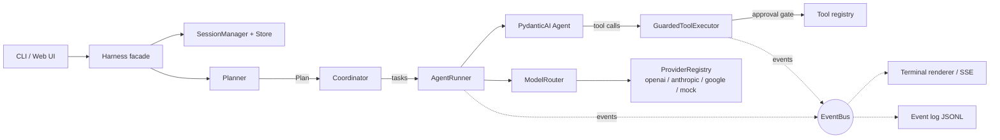

# om-harness

A context-efficient AI coding-agent harness for real git repositories.

om-harness runs AI coding agents inside your project: it inspects the repo,
plans the work, edits files, runs tests, and reports what it did — while
keeping a tight lid on context usage, latency, and cost.

```console
$ cd your-project
$ om-harness init
$ om-harness run "fix the failing test in test_worker.py"
```

---

## Why om-harness exists

Most coding-agent demos are a thin loop around a chat model: they resend the
whole conversation, the entire system prompt, and every file the agent ever
saw — on every single turn. That wastes tokens, adds latency, and makes
multi-step and multi-agent work needlessly expensive and unpredictable.

om-harness is built around three ideas that address this directly:

1. **Context is a budget, not a dump.** Repository context comes from a
   cached, bounded file index (paths + sizes, not contents). System prompts
   are small and role-scoped. Agents exchange compact structured
   `TaskResult`s, never conversation transcripts. Old history is summarized,
   not resent. Everything sent to the model is itemized in a token report.
2. **Orchestration is a plan, not vibes.** A planner picks the simplest
   strategy that can complete the goal — usually a single agent. When it
   doesn't, work is expressed as an inspectable task graph (sequential
   pipeline, parallel fan-out/fan-in, or implement→review) executed by a
   coordinator with bounded concurrency, timeouts, retries, and cancellation.
3. **Reliability and safety are structural.** Every meaningful operation is
   a typed event on one bus (UIs, logs, and persistence all subscribe to the
   same stream). State is durable and resumable. Tools carry permission
   levels (read-only / mutating / destructive) gated by a configurable
   approval policy that fails safe in non-interactive contexts.

It is **not** an agent framework you build products on top of — it is a
working coding assistant, plus a small, readable codebase where every design
decision is visible.

## Feature highlights

- **CLI-first**: `init`, `run`, `chat`, `agent`, `providers`, `doctor`,
  `status`, `resume`, `config` — each with `--json` output for automation.
- **Multi-provider** via [PydanticAI](https://ai.pydantic.dev): OpenAI,
  Anthropic, Google/Gemini through one interface; task-type routing
  (cheap models to explore, strong models to implement), explicit overrides,
  and a fully offline `mock:` provider for demos and tests.
- **Async orchestration**: parallel fan-out/fan-in with deterministic
  aggregation, per-task timeouts, retries with backoff, and cancellation.
- **Repository tools**: file list/read/search/write/edit, safe shell
  execution, git status/diff/log/show/add/commit/restore, test-runner
  detection and execution, repo info — all schema'd, timeout-bounded, and
  output-capped.
- **Durable sessions**: state in `.om-harness/` (gitignored), atomic writes,
  checkpoints, and `resume` for interrupted work.
- **Observability**: every run, agent call, tool call, approval, retry, and
  usage figure is a typed event; `--verbose`/`--debug` expose them.
- **Web reference client**: the same runtime, consumed over HTTP/SSE —
  proving the UI/runtime split.

## Install

Requires [uv](https://docs.astral.sh/uv/) and Python 3.11+.

```bash
git clone https://github.com/om-harness/om-harness
cd om-harness
uv sync
uv run om-harness --version
```

Or install into your environment with `uv tool install .` from a clone.

## Configure providers

API keys are read from the environment (never from config files, never
stored, never logged):

```bash
export OPENAI_API_KEY=...        # or ANTHROPIC_API_KEY / GOOGLE_API_KEY
```

With no keys at all, om-harness still works offline using the built-in mock
provider — useful for demos, tests, and CI.

Optional file configuration in `om-harness.toml` (or `[tool.om-harness]` in
`pyproject.toml`):

```toml
[routing]
default_model = "openai:gpt-4o-mini"

[routing.task_models]
explore = "openai:gpt-4o-mini"
implement = "anthropic:claude-sonnet-4-5"

[approval]
policy = "auto"          # ask | auto | allowlist | deny
allowlist = ["write_file", "edit_file"]
```

Environment variables override the file: `OM_HARNESS_DEFAULT_MODEL`,
`OM_HARNESS_APPROVAL_POLICY`, `OM_HARNESS_MAX_CONCURRENCY`,
`OM_HARNESS_VERBOSITY`, `OM_HARNESS_MAX_REQUESTS`. See
[docs/configuration.md](docs/configuration.md).

## First run

```bash
om-harness init                 # creates .om-harness/, updates .gitignore
om-harness doctor               # checks git, config, state dir, providers
om-harness run "explain the module layout in src/"          # read-only task
om-harness run "add input validation to parser.py and test it"
om-harness status               # sessions, checkpoints, providers
om-harness resume               # inspect and continue the latest session
```

Interactive chat:

```bash
om-harness chat                 # then: /tools, /status, or just talk
```

No keys at all? Watch a complete coding flow (inspect → edit → test) run
offline through a scripted model:

```bash
uv run python scripts/demo.py
```

Automation (exit code reflects run status):

```bash
om-harness run "fix lint errors in src/" --json --approval-policy auto
```

Verbosity: default output is compact (plan, key activity, summary);
`--verbose` adds tool calls, agent handoffs, and usage; `--debug` prints
everything.

## How it works



One request flows roughly like this: the **Harness** resolves or creates a
**Session**, the **Planner** produces a **Plan** (usually one task), the
**Coordinator** executes the task graph through **AgentRunner**, each task
becomes one PydanticAI agent invocation with scoped context and tools, and
every step publishes **Events**. Results are persisted, a **Checkpoint** is
saved, and the CLI renders a summary. Details in
[docs/architecture.md](docs/architecture.md).

### What makes it context-efficient

| Waste in a naive loop | om-harness behavior |
|---|---|
| Repo contents re-sent each turn | Cached `RepoIndex` summary (paths + sizes, capped) |
| One giant system prompt | Small role-scoped prompts (planner/explorer/implementer/reviewer/chat) |
| Full transcripts passed between agents | Structured `TaskResult` (summary, findings, files, errors) |
| Unbounded history growth | History trimmed to a window; the dropped tail becomes a one-line summary |
| Invisible cost | Per-component token ledger; `status` shows the effective model and usage |

These properties are enforced by tests (see `tests/unit/test_context.py`),
not just by convention.

## Testing strategy

The default suite is fully deterministic and needs no API keys — provider
calls go through PydanticAI's `FunctionModel` scripting, which exercises the
real agent loop. Race-prone parallelism is tested with sentinel
synchronization that would deadlock if work were serialized.

```bash
make check               # format + lint + types + tests (with coverage gate)
uv run pytest            # fast: unit + e2e
uv run pytest -m integration   # live provider round-trips (needs keys)
```

## Documentation

- [docs/architecture.md](docs/architecture.md) — components, lifecycle,
  orchestration, context strategy, tool safety, state model (with diagrams)
- [docs/design.md](docs/design.md) — design document and tradeoffs
- [docs/configuration.md](docs/configuration.md) — config files and env vars
- [CONTRIBUTING.md](CONTRIBUTING.md) — development setup and workflows

## Project layout

```
src/om_harness/
├── models/          # Pydantic contracts: events, tasks, plans, sessions
├── config/          # TOML + env configuration, secret redaction
├── providers/       # provider registry, task-type router, mock models
├── context/         # repo index, token budgeting, scoped assembly
├── tools/           # repo tools + permission levels + approval engine
├── runtime/         # event bus, session/checkpoint manager, agent runner
├── orchestration/   # planner, coordinator (waves/concurrency)
├── ui/              # shared components, terminal renderer, REPL, web/
└── cli/             # Typer application
```

## License

MIT — see [LICENSE](LICENSE).
