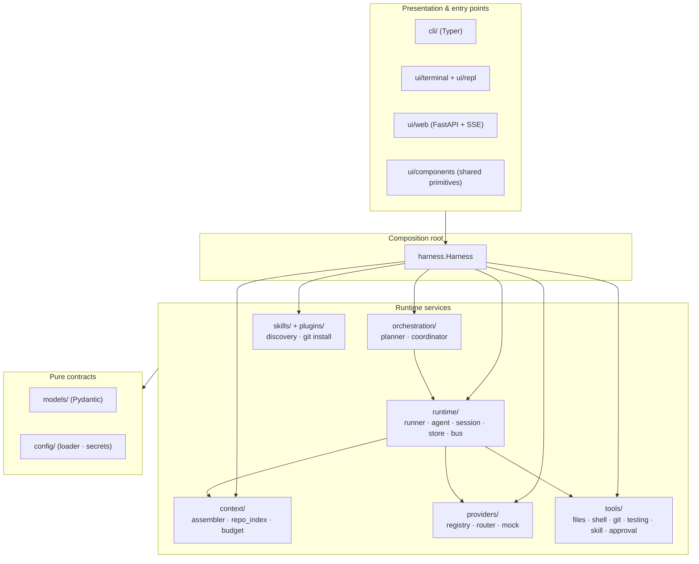
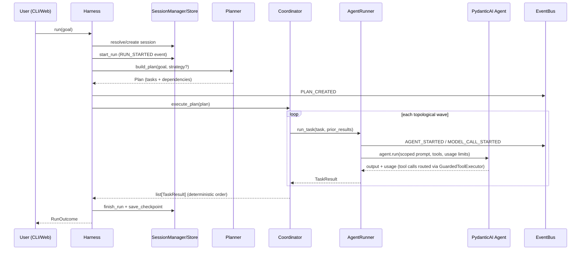
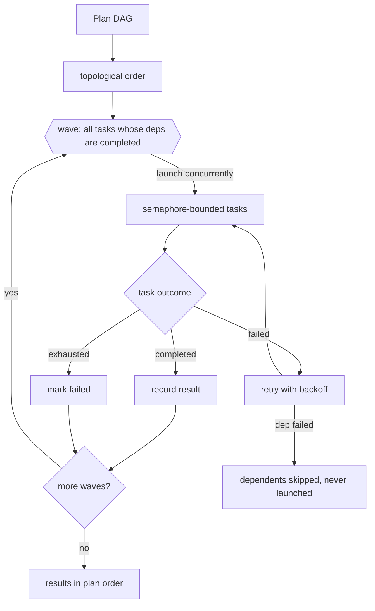

# Architecture

This document explains how om-harness is structured, how a request flows
through the system, and the responsibilities of every component. For the
reasoning behind these choices, see [design.md](design.md).

## Layered overview

om-harness has four layers with strictly one-directional dependencies. The
innermost layer (`models`) imports nothing from om-harness; the outermost
(`cli`, `ui.web`) imports only the facade.



Dependency rules:

1. `models/` and `config/` are pure — no I/O, no imports from other layers.
2. Runtime services depend on models and each other only through narrow
   protocols (e.g. the coordinator depends on a `TaskExecutor` protocol, not
   on `AgentRunner`).
3. Presentation never touches runtime services except through `Harness`.
4. Provider SDKs are imported only inside `providers/registry.make_model`.

## Component responsibilities

| Component | Responsibility |
|---|---|
| `models/events.py` | Typed `Event` envelope + `EventType` catalog; the instrumentation vocabulary |
| `models/task.py` | `Task`, `TaskResult`, `Plan` (validated DAG), `StrategyKind`, `TokenUsage` |
| `models/session.py` | `Session`, `Message`, `RunRecord`, `Checkpoint` |
| `config/loader.py` | TOML + env loading, strict validation (`ConfigError` at startup) |
| `config/secrets.py` | `SecretRedactor`: value- and key-based credential scrubbing |
| `runtime/bus.py` | Async pub/sub `EventBus`; publish-time redaction; bounded history drained via monotonic `seq` cursors (`cursor` / `since`) |
| `runtime/store.py` | `LocalStore`: atomic JSON/JSONL persistence under `.om-harness/` |
| `runtime/session.py` | `SessionManager`: sessions, messages, runs, checkpoints |
| `runtime/agent.py` | `AgentFactory`: registry tools → PydanticAI `Agent` (the one bridge) |
| `runtime/runner.py` | `AgentRunner`: one task → one agent run, with timeout/budget/events |
| `providers/registry.py` | Model-string parsing, availability via env keys, model factory |
| `providers/router.py` | Task-type → model selection with overrides and fallback chain |
| `providers/mock.py` | `FunctionModel`-based offline models (`mock:echo`, scripted) |
| `context/repo_index.py` | Cached, bounded repo file map |
| `context/budget.py` | Token estimation + per-component `ContextLedger` |
| `context/assembler.py` | Role prompts, history trimming/summarization, `ContextReport` |
| `skills/` | `SKILL.md` discovery (frontmatter parsing) + on-demand body loading |
| `plugins/` | Git-installable plugins: source parsing, clone/update/uninstall, provenance |
| `tools/base.py` | `Permission`, `ToolResult`, `ToolContext`, path confinement |
| `tools/approval.py` | `ApprovalEngine`: policy → decision, async confirmer |
| `tools/registry.py` | `ToolRegistry` + `GuardedToolExecutor` (approval + events) |
| `tools/skill.py` | `SkillTool`: loads a registered skill's full instructions on demand |
| `orchestration/planner.py` | Strategy choice + plan construction (smallest plans first) |
| `orchestration/coordinator.py` | Topological waves, semaphore, retries, timeouts, skips |
| `harness.py` | Composition root: `run`, `chat_turn`, `status`, `doctor`, `init_repo` |

## Run lifecycle



Event sequence for a successful single-task run (stable, asserted in tests):

```
run.started → plan.created → task.started → agent.started →
model.call.started → (tool.call.started/completed/denied …) →
model.call.completed → agent.completed → task.completed →
run.completed → checkpoint.saved
```

## Orchestration strategy

The planner's heuristic deliberately over-weights *single agent*:

| Condition | Strategy |
|---|---|
| default | `single` — one task, one agent |
| "…then…" / "after that" phrasing | `sequential` (explore → implement) |
| review/check phrasing | `reviewer` (implement → review) |
| multiple user-declared tasks, no deps | `parallel` |
| multiple user-declared tasks with deps | `sequential` over the declared graph |

The **coordinator** executes any plan the same way:



Properties (all proven in `tests/unit/test_orchestration.py`):

- **Parallelism is real**: independent tasks in one wave run concurrently —
  a sentinel test deadlocks if the coordinator serializes them.
- **Aggregation is deterministic**: results are returned in plan-declaration
  order, never completion order.
- **Failure isolation**: a failed dependency causes dependents to be
  *skipped* (status `skipped`), never executed.
- **Bounded resources**: `max_concurrency` semaphore; per-task timeout via
  `asyncio.timeout`; retry with exponential backoff (base 0.05 s).

## Context-management strategy

`ContextAssembler` builds the entire model-visible context per invocation:

1. **System prompt**: `BASE_PROMPT` + one small role template. No role
   prompt exceeds a few hundred characters; there is no universal
   mega-prompt.
2. **Repository context**: `RepoIndex.summary()` — a cached listing of
   relative paths and sizes, capped by `context.max_repo_index_files`.
   Built once per session; `invalidate()` on demand.
3. **History**: at most `context.max_history_messages` messages. When the
   history is longer, the dropped tail is replaced by a one-line extractive
   summary that counts toward the window. Old messages are never resent.
4. **Prior agent results**: rendered from `TaskResult` models only —
   summary, findings, files touched, errors. Sub-agent transcripts never
   cross agent boundaries.
5. **Token ledger**: every component's estimated size (≈ chars/4) is
   recorded; `ContextReport` itemizes it. This is the "why did a run use
   its context" answer.
6. **Available skills**: when skills are discovered, the system prompt
   gains one section — a one-line `name: description` listing plus an
   instruction to load a matching skill through the `skill` tool. The full
   SKILL.md body is *not* sent up front (progressive disclosure, see
   `skills/` below); with no skills installed the prompt is unchanged.

## Skills and plugins

Skills are small markdown instruction packs — a directory with a
`SKILL.md` carrying a tiny frontmatter (`name`, `description`, optional
`argument-hint`). Discovery is deliberately cheap (frontmatter only) and
reads from, in override order (later wins on name collision):

| Source | Location | Label |
|---|---|---|
| plugins | skills shipped inside installed plugins | `plugin:<name>` |
| user | `~/.agents/skills` (`OM_HARNESS_SKILLS_DIR` override) | `user` |
| config | `[skills].extra_dirs` | `extra` |
| repo | `<repo>/.agents/skills` | `repo` |

`Harness.__init__` resolves this into `harness.skills` and registers one
read-only `SkillTool` when the set is non-empty. Namespacing: every plugin
skill is also registered as `<plugin>:<skill>`; plain names are filled
only when still free, so user/repo skills always win collisions. The
`skill` tool resolves names exclusively against this registry — it has no
path argument, so reading skill files from outside the repo root (a
deliberate exemption from path confinement) cannot be turned into an
arbitrary read. `[skills] enabled = false` disables discovery entirely.

Plugins are git repositories cloned (shallow) into `~/.om-harness/plugins`
(`OM_HARNESS_PLUGINS_DIR` override) by `om-harness install`, with an
optional `plugin.json` manifest and a `.om-harness-plugin.json`
provenance record (source spec + commit). Reinstalling updates via
`git pull --ff-only`; `plugins` lists and `uninstall` removes. A plugin
contributes its skills to the registry above at the next harness start;
no other harness code path is plugin-aware.

## Provider integration model

om-harness treats PydanticAI as the unified provider interface and adds only
what it lacks:

- **Availability**: a provider is available iff one of its env keys is set
  (`OPENAI_API_KEY`, `ANTHROPIC_API_KEY`, `GOOGLE_API_KEY`/`GEMINI_API_KEY`).
  The `mock` provider is always available.
- **Resolution**: model strings are `provider:model` (e.g.
  `anthropic:claude-sonnet-4-5`, `google-gla:gemini-2.0-flash`). Unknown
  prefixes raise `ProviderError` early — before any request is made.
- **Routing**: `ModelRouter.select(task_type, override)` — explicit override
  beats configured `task_models` beats automatic routing (cheap default for
  explore, strong model for implement/review) beats `default_model` beats
  `mock:echo`.
- **Fallback**: `ModelRouter.fallback_chain(primary)` returns primary +
  configured `fallbacks` for constructing PydanticAI `FallbackModel`s.
- **Degradation**: `make_model` returns `None` for unavailable providers
  instead of raising mid-run; `doctor` reports availability per provider.

## Tool safety model

Every tool declares one of three permission levels:

| Level | Tools | Behavior |
|---|---|---|
| `read_only` | list/read/search files, git status/diff/log/show, repo info, skill | always allowed |
| `mutating` | write/edit file, run_shell, run_tests, git add/commit | gated by policy |
| `destructive` | git restore (discards work) | gated by policy, never auto-approved |

Policies (config `approval.policy`, or `--approval-policy`):

- `auto` — mutating runs freely; destructive requires confirmation
- `ask` — mutating + destructive require confirmation (async confirmer →
  rich prompt in the terminal, HTML dialog in the web client)
- `allowlist` — only named tools run without confirmation
- `deny` — nothing mutating/destructive runs

Fail-safe rule: a request that needs confirmation in a **non-interactive**
context resolves to *denied*, never silently approved.

Shell execution is deliberately constrained: argv-list execution with
`shell=False`, rejection of shell metacharacters and catastrophic command
patterns, hard timeouts, output caps, and a scrubbed environment (no
credential-looking variables). All file tools resolve paths strictly inside
the repository root. The one exemption is the `skill` tool, which reads
skill files from user-level directories outside the repo — safe because
its only argument is a name resolved against the discovery registry, never
a path.

## State / checkpoint model

```
.om-harness/
├── sessions/<session_id>.json         # Session: messages, runs, status
├── events/<session_id>.jsonl          # append-only typed event log
└── checkpoints/<session_id>/<id>.json # compact resumable state
```

- **Atomicity**: writes go to a temp file + `os.replace`; a crash mid-write
  leaves the previous state intact (tested).
- **Checkpoints** store compact state — plan, task results, completed ids,
  summary, next hint — *not* transcripts. Resuming rebuilds scoped context
  from the checkpoint plus a fresh repo index.
- **Events** are appended from the bus after each run via a seq-cursor
  window (`bus.since(cursor)` — correct even when the bounded history has
  evicted entries; deterministic, no async race). A torn final line after a
  crash is tolerated on read.
- **Secrets**: the redactor runs at publish time; nothing credential-shaped
  should reach the store, and a test scans the entire state directory to
  prove it.

## Terminal UX and web architecture

Both clients consume the same two artifacts:

- the **event stream** (`EventBus` subscribers; SSE endpoint in the web app),
- the **session model** (`SessionManager`).

`ui/components.py` converts events/outcomes into `DisplayLine` and
`RunSummaryView` objects, applying verbosity filtering once, shared by both
clients. The terminal renderer maps them to rich markup; the web `/api/chat`
endpoint returns them as JSON and `/api/events/{id}` streams them via SSE.
The web client is a reference: no business logic, no build step, one page.

The interactive REPL streams live on top of the same artifacts: a pump task
polls `bus.since(cursor)` every 50 ms and renders thinking/text deltas,
file-change diffs, and executed commands as they happen (deduplicated by
event id), with an end-of-turn sweep that renders anything the pump missed
on every exit path. Draining is by monotonic `seq` cursor, never by
positional offset into the bounded history — positional slicing goes
permanently silent once the deque starts evicting (the live view would
freeze mid-turn while the agent continues; see design Tradeoff 12).

Slash commands are UI-only dispatch (no agent round-trip) backed by
`apply_config_update`, which mutates the live config and persists to
`~/.om-harness/config/config.toml`. `/timeout` shows or sets the agent and
tool timeouts; `/timeout off` (or `/config set agent_timeout|tool_timeout
off`) disables them — `None` in the config, which `asyncio.timeout` and
`wait_for` treat as "no timeout". Tool timeouts propagate immediately
through the shared live `ToolContext`.

## Testing strategy

- **Unit tests** cover every module contract; provider APIs are mocked via
  PydanticAI `FunctionModel`/`TestModel` so the *real* agent loop is
  exercised without network. No API keys needed.
- **Concurrency tests** are deterministic: sentinels + `asyncio.wait_for`
  timeouts instead of sleeps; a coordinator that serializes parallel work
  would deadlock and fail the test.
- **E2E tests** run complete flows (plan → tools → edit → tests →
  checkpoint → resume) in real temp git repositories.
- **Integration tests** (`-m integration`, deselected by default) do live
  provider round-trips and skip themselves when keys are absent.
- **Safety tests** prove the negative cases: denied tools never execute,
  secrets never persist, parallel work is not serialized, context is not
  re-sent.

## Extending

- **New provider**: add a `ProviderSpec` in `providers/base.py` and a
  branch in `registry.make_model`. Routing and doctor pick it up
  automatically.
- **New tool**: subclass `BaseTool`, define an `Args` model, register it in
  `tools.build_default_registry`. Permissions and eventing are inherited.
- **New skill source**: add a `(dir, label)` pair to `Harness._resolve_skills`
  (or install a plugin — `plugins/` already feeds its skills there).
  Frontmatter rules live in `skills.parse_skill_md`.
- **New strategy**: add a `StrategyKind`, a planner rule, and (if needed) a
  coordinator pattern; strategies are data (plans), not code paths, wherever
  possible.
- **Remote runtime / shared state**: `LocalStore` and `EventBus` are the
  seams — replace with a networked implementation without touching the
  runtime.
